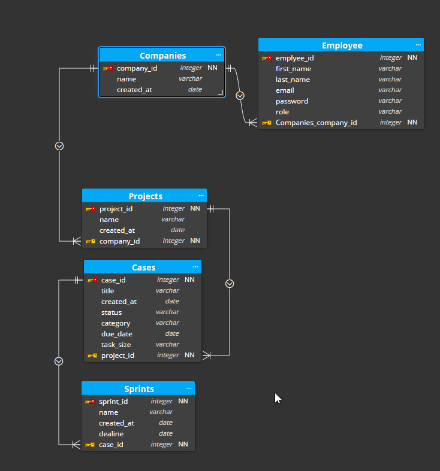

# **CodeSprint**

You can see the live website [here]([https://browne878-sudoku-cli.herokuapp.com/](https://pp4-codesprint.herokuapp.com/accounts/login/)).

The purpose of this website is to give a development company the ability to manage their agile development process and track progress.

This app is meant to be deployed and hosted internally to isolate sensitive information.

My aim for CodeSprint is to provide a development assistant that allows all levels of a company to track their progress on a project.

## **Table of Contents**

- ### [Planning]()

- ### [Features]()
    - [Instructions]()

- ### [Models]()

- ### [Future Development]()

- ### [Testing]()

- ### [Bugs]()
    - [Unfixed Bugs]()
    - [Fixed Bugs]()

- ### [Deployment]()
    - [Cloning/Forking Repository]()
    - [Local Deployment]()
    - [Remote Deployment]()

- ### [Credits]()

## **Planning**

I wanted to create a new tool to help during my development process. This app was made with what I learnt from using other applications and tools to manage my projects progress.

## **Features**


## **Models**

I used an application called Moon Modeler to help me build the models for this project. I did need to make a small number of changes during the development process in order for user to be able to login and be related to a company. You can see the model design below.



## **Future Development**

- In the future I would add an admin environment where they can manage the users in the company as well as the company itself.

## **Testing**

To test this project, I ran my code through PEP8 Checker, W3C Markup Validation Service and the W3C CSS validation Service.

I also went through the website ensuring that everything worked as intended.

I used Django's built in testing to develop tests to check the Login and Register views.

## **Bugs**

### Unfixed Bugs

There are no known bugs at this time.

### Fixed Bugs


## **Deployment**

### Cloning / Forking Repository

In order to Fork the Repository, please follow the instructions below.
 1. Navigage to [this](https://github.com/browne878/CodeSprint-Portfolio-Project-4) repository.
 2. Next, in the top left of the page, click the fork button.
 3. If you are a member of a team, you may need to choose where to Fork the repository too.

Once you have forked the Repository, you can then clone it to your local machine. To do so, please follow the instructions below.
 1. Navigate to your Forked repository.
 2. Click the green Code button above the repositories files.
 3. Copy the URL in the dropdown window.
 4. Next, open command prompt.
 5. After this, navigate to the directory you would like to clone the repository too with the following command.
 ```
cd <clone location>
 ```
 6. Then, run the following command.
 ```
git clone <URL>
 ```
 
You have now forked and cloned the repository.

### Local Deployment

These instructions will tell you how to deploy the repository on your local machine with VSCode and the extension [Live Server](https://marketplace.visualstudio.com/items?itemName=ritwickdey.LiveServer). Please ensure you have VSCode and the Live Server extension installed before beginning the following steps.

1. First, follow the steps for Cloning and Forking the repository so you have the repository locally.
2. Open the folder with VSCode by doing one of the following:
    - Right click the file and click `Open with Code`
    - Open command prompt, navigate inside the directiory and run the command `code .`
    - Open VSCode, click file, open folder and then navigate to the repository folder and open it.
3. Next, at the very bottom of the window, there will be a button that says `Go Live`. Click this button and it will deploy it locally and open it in your default browser for you to view.

### Remote Deployment

The following instructions will guide you the deployment process for Heroku. I will assume you already have a [Heroku](https://www.heroku.com/) account.
1. First, follow the instructions to clone the repository to your GitHub.
2. On Heroku, login and navigate to your dashboard.
3. In the top right, click `New` and select `Create a new app`.
4. Next, name your app and select your region and click `Create app`.
5. After this, under the deployment method, select GitHub and link your account with GitHub.
6. Then, search for your cloned repository and click `Connect`.
7. Under the `Automatic deploys` section, ensure the main branch is selected and click the `Enable Automatic Deploys`.
8. Also, under the main branch is selected in the `Manual deploy` section.
9. Next, at the top of the page, navigate to the settings page.
10. After this, go to the resources tab on heroku and search for `Heroku Postgres` under the add-ons tab.
11. Then, you will need to go to [Cloudinary](https://cloudinary.com/console/c-e41e529a42f687f55f451d5505dfd8/getting-started) and sign up.
12. Once you have signed up, go to the dashboard and copy the `API Environment variable`.
13. After this, under the `Config Vars` section, click the `Reveal Config Vars` button and enter the following `CLOUDINARY_URL` : `Variabe from cloudinary website (being sure to remove the CLOUDINARY_URL= from the start` - `SECRET_KEY` : `Generate this yourself but make it random so it is secure`.
14. Then, in the section below (`Buildpacks`), click `Add buildpack` and select python.
15. Repeat the previous step, but this time, select NodeJS.
16. Once this is done, ensure that the python buildpack is at the top of the list. (You can drag them to move them).
17. Then, at the top of the page, navigate back to the deploy section.
18. Finally, you can scroll to the bottom of the page and click the `Deploy Branch` button under the `Manual deploy` section.
19. Once the deployment is complete, you can click the `Open app` button at the top right of the page. This will open the deployed app in a new tab.

## **Credits**

This app was built using only the documentation from Bootstap, Django and JQuery.
